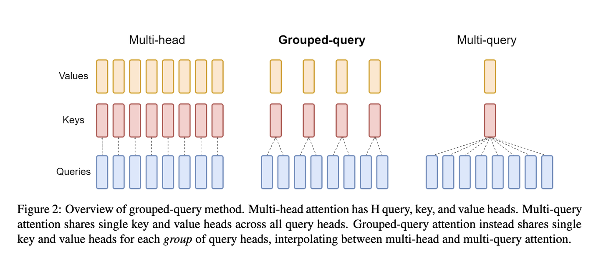
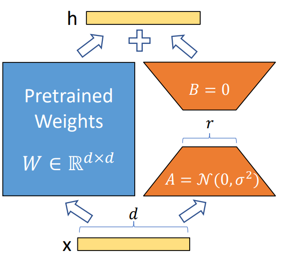

## 模型简介
### 大语言模型的金融应用概述
随着人工智能技术的快速发展，金融机构开始探索人工智能新技术的应用，并引入各类大语言模型作为新的解决方案。大语言模型具有强大的自然语言处理能力，可在多个方面助力金融行业的发展。
1. 大语言模型可以解决**金融业信息分散**和**不对称、多个系统之间数据的整合和交互不够**等问题，能够有效地理解和处理复杂的金融数据，并提供更直观、便捷的信息查询和解释服务，有助于提高金融机构内部的运营效率和决策质量。
2. 大语言模型能够促进金融行业更好地利用人工智能技术，通过智能化的交互界面提供更直接、高效的金融服务，推动金融业进一步去中介化，降低传统金融中介机构高额的交易成本并优化复杂的服务流程，为金融机构和客户提供便利、高效的金融服务。
3. 得益于良好的**自然语言处理**能力，大语言模型在金融业的应用还可以服务于**情感分析、市场预测**，为企业与个人提供较为专业的投资建议。


### Llama2模型
Llama2模型是Meta AI正式发布的最新一代开源大模型。它的最高参数达到700亿，在2万亿tokens上进行训练，并且是**开源免费可商用**的，推动了大型语言模型在开源界的繁荣发展。其具有以下优势：
1. **高效性**：Llama2可以在相对较少的计算资源上进行训练，这降低了训练成本和时间。同时，它还可以支持更多的自然语言任务，包括问答、文本生成、摘要生成等。
2. **灵活性**：Llama2可以轻松地适应各种自然语言处理任务，并且可以与其他模型进行集成，以提高性能。此外，它还可以根据特定需求进行微调，以进一步提高性能。
3. **可扩展性**：Llama2支持多语言和多模态数据，这意味着它可以处理不同语言和类型的数据，包括文本、图像、音频等。这为跨语言和跨模态的自然语言处理任务提供了更大的灵活性。
4. **开放性**：作为开源模型，Llama2的代码和数据都是公开的，这促进了学术和工业界之间的合作和创新。此外，它也为研究人员提供了一个平台，以探索和开发新的自然语言处理技术。
### NKSM模型简介
本模型(NKSM)基于预训练的 Llama2 模型，利用 ubuntu 系统服务器进行模型部署，运用 LoRA 方法对模型进行微调，使之具备统计与金融方面的专业分析能力，旨在实现以下功能：
1. **信息检索**功能，我们将基于 MySQL 建立金融财报方面的知识库，录入70GB的已标注财报信息并将其接入 NKSM 模型，从而满足用户对企业运营信息的检索需求。
2. **基础问答**功能，NKSM 模型就用户所提出的基础金融问题进行回答，向用户解释部分金融术语的含义，实现基本金融知识的科普。
3. **金融计算**功能，用户可以就部分金融统计量向 NKSM 模型进行提问，NKSM 模型将基于知识库中已有的信息进行高阶数据的分析与相关统计量的计算，并对结果进行简要分析。
4. **预测与建议**功能，NKSM 模型可以基于知识库中已标注的数据生成投资建议，对用户的投资行为进行一定程度上的指导。
5. **分析与分类**功能，NKSM模型可以分析用户输入的企业或个体金融行为信息，对其进行分类，从而对行为主体的金融信誉及经济状况进行分类评估，并向用户提供其在各类现行国际标准下的信用评级。

#### NKSM模型信息
- 基础模型：Llama2
- 训练数据集：2万亿token
- 参数量：70B
- 模型结构：transformer(decoder-only)
- 神经网络架构：前馈算法
- 微调方法：lora监督微调

### 数据集信息
#### 数据集JSON样式示例
```json
{"id": 0, "question": "2021年其他流动资产第12高的是哪家上市公司？", "answer": "2021年其他流动资产第12高的公司是苏美达股份有限公司。"}
{"id": 1, "question": "注册地址在重庆的上市公司中，2021年营业收入大于5亿的有多少家？", "answer": "2021年注册在重庆，营业收入大于5亿的公司一共有4家。"}
{"id": 2, "question": "广东华特气体股份有限公司2021年的职工总人数为？", "answer": "2021年广东华特气体股份有限公司职工总人数是1044人。"}
{"id": 3, "question": "在保留两位小数的情况下，请计算出金钼股份2019年的流动负债比率", "answer": "2019金钼股份流动负债比率是61.10%。其中流动负债是1068418275.97元；总负债是1748627619.69元；"}
{"id": 4, "question": "2019年负债总金额最高的上市公司为？", "answer": "2019年负债合计最高的是上海汽车集团股份有限公司。"}
{"id": 5, "question": "2019年总资产最高的前五家上市公司是哪些家？", "answer": "2019年资产总计最高前五家是上海汽车集团股份有限公司、中远海运控股股份有限公司、国投电力控股股份有限公司、华域汽车系统股份有限公司、广州汽车集团股份有限公司。"}
{"id": 6, "question": "2020年营业收入最高的3家并且曾经在宁波注册的上市公司是？金额是？", "answer": "注册在宁波，2020年营业收入最高的3家是宁波均胜电子股份有限公司营业收入47889837616.15元；宁波建工股份有限公司营业收入19796854240.57元；宁波继峰汽车零部件股份有限公司营业收入15732749552.37元。"}
{"id": 7, "question": "注册地址在苏州的上市公司中，2020年利润总额大于5亿的有多少家？", "answer": "2020年注册在苏州，利润总额大于5亿的公司一共有2家。"}
{"id": 8, "question": "浙江运达风电股份有限公司在2019年的时候应收款项融资是多少元？", "answer": "2019年浙江运达风电股份有限公司应收款项融资是51086824.07元。"}
{"id": 9, "question": "神驰机电股份有限公司2020年的注册地址为？", "answer": "2020年神驰机电股份有限公司注册地址是重庆市北碚区童家溪镇同兴北路200号。"}
{"id": 10, "question": "2019年山东惠发食品股份有限公司营业外支出和营业外收入分别是多少元？", "answer": "2019年山东惠发食品股份有限公司营业外收入是1018122.97元；营业外支出是2513885.46元。"}
{"id": 11, "question": "福建广生堂药业股份有限公司2020年年报中提及的财务费用增长率具体是什么？", "answer": "2020福建广生堂药业股份有限公司财务费用增长率是34.33%。其中，财务费用是7766850.48元；上年财务费用是5781839.51元。"}
{"id": 12, "question": "华灿光电股份有限公司2021年的法定代表人与上年相比相同吗？", "answer": "不相同，华灿光电股份有限公司2020年法定代表人是俞信华，2021年法定代表人是郭瑾。"}
{"id": 13, "question": "请具体描述一下2020年仲景食品控股股东是否发生变更。", "answer": "2020年，仲景食品控股股东没有发生变更。"}
{"id": 14, "question": "什么是其他债权投资？", "answer": "其他债权投资是指企业或机构投资者通过购买债券、贷款、定期存款等金融产品获得的固定收益。这些金融产品通常由政府、公司或其他机构发行，具有一定的信用等级和风险。\n\n其他债权投资是企业或机构投资组合中的一部分，通常用于稳定收益和分散风险。与股票投资相比，其他债权投资的风险较低，但收益也相对较低。\n\n其他债权投资的管理和投资策略与其他资产类别类似，包括分散投资、风险控制、收益最大化等。然而，由于其他债权投资的种类繁多，其投资和管理也存在一定的特殊性。"}
```


## NKSM模型原理概要

### Transformer结构
本次我们使用的 Llama2 模型结构为 Transformer，其整体结构如图所示。


Transformer结构主要由输入层、词嵌入层、编码器和解码器层、输出层和注意力机制组成。
1. **输入层**：将输入的句子中的每个词表示成一个向量，然后输入到Transformer模型中。
2. **词嵌入层**：将输入层的向量作为输入，将每个词转化成一个更高维度的向量，以便模型可以更好地处理这些信息。
3. **编码器和解码器层**：Transformer模型的核心部分，它包含了若干个编码器和解码器层，负责将输入序列编码成一个稠密的向量表示，然后将这个向量解码成输出序列。
4. **输出层**：将解码器层的输出转化成输出序列中的词的概率分布。
5. **注意力机制**：在编码器和解码器层中，注意力机制负责根据当前输入和之前的输出计算出一个权重分布，表示当关注输入序列的不同部分时，解码器应给予不同的权重。

### Llama2对结构的改进

Llama 系列大语言模型采用 decoder-only 结构，Llama2 模型采用64个 Decoder 层，每个decoder层如下图所示。


相较于Llama模型，Llama2将transformer中的LayerNorm换成了RMSNorm，Multi-Head Attention由MQA换成了GQA,postionnal由绝对位置编码换成了RotatyEmbedding（RoPE相对位置编码）。

#### 数据标准化方面的改进
在Llama模型中，数据标准化采用LayerNorm法，其公式表达如下：$$ y=\frac{x-E(x)}{\sqrt{Var(x)+\varepsilon}}\times\gamma+\beta $$ 其中，$\gamma$ 为缩放参数，$\beta$ 为平移参数。

而 Llama 模型则采用 RMSNorm 法，其公式表达如下：
$$
\overline{a_i}=\frac{a_{i}}{RMS(a)}g_i\quad,\quad RMS(a)=\sqrt{\frac{1}{n}\sum_{i=1}^n a_i^2}$$
相较于 LayerNorm 法，RMSNorm 法有以下优点：
1. **计算效率高**：RMSNorm 的计算代价较低，尤其适用于小批次的训练数据，而 LayerNorm 在进行每一层的归一化时需要计算每个神经元的均值和标准差，计算量较大，不适用于小批次的数据。综合来看，采用RMSNorm法可以减少了 $7\%∼64\%$ 的计算时间。
2. **更好的收敛速度**：由于 RMSNorm 能够有效解决内部协变量偏移问题，它可以加快模型的收敛速度，提高训练效率。而 LayerNorm 虽然也可以加速训练，但效果不如RMSNorm。
3. **更广泛的应用领域**：RMSNorm 不仅适用于图像分类任务，还可以应用于其他领域，如目标检测、语音识别等。而 LayerNorm 主要应用于神经网络模型的每一层，使用范围相对较窄。

#### 多头注意力模型方面的改进
原始的 MHA 模型 QKV 三部分有相同的头数，且一一对应，实质上是进行线性变换得到输出矩阵，其性能较优但需要消耗大量的算力，算法吞吐量不甚理想。基于这一点，Llama模型采用MQA模型，将KV头数缩减至一个，以些许性能为代价换取$30\%\sim40\%$的吞吐量。而Llama2模型则将MQA模型进行改进，推出GQA模型，该模型综合了MHA与MQA的优点，对Q头进行分组，同一组之内的Q头共享一组KV头。三种模型的原理如下图：



#### 位置编码方面的改进

<!-- 从原理上讲，Transformer是无法隐式学到序列的位置信息的，为了可以处理序列问题，Transformer提出者的解决方案是使用位置编码（Position Encode/Embedding，PE），起初在Llama模型中为了计算方便使用绝对位置编码，即序列中每个位置都有一个固定的位置向量，计算如下：
$$
\begin{align*} 
PE_{t,2i}&=\sin\left(\frac{t}{10000^{2i/d}}\right) \\
PE_{t,2i+1}&=\cos\left(\frac{t}{10000^{2i/d}}\right)\end{align*}
$$
而在一个序列中，第$i$个单词和第$j$个单词的attention score计算如下：
$$A^{abs}_{i,j}=(W_q(E_{x_i}+U_i))^{\mathrm{T}}(W_k(E_{x_j}+U_j))$$
其中$W_q$，$W_k$分别是多头注意力模型给每个head加的query和key参数。经过多头注意力模型的线性变换之后，$A_{i,j}^{abs}$将几乎不含相对位置信息.

因此，为改善这种情况，-->

Llama2模型采用相对位置编码。其具体做法是在计算attention score和weighted value时各加入一个可训练的表示相对位置的参数，并且multi head之间可以共享，即：

$$
\begin{align*}e_{ij}&=\frac{x_{i}W_q(x_jW_k+a_{ij}^k)^T}{\sqrt{d_{z}}}\\z_i&=\sum\limits_j \alpha_{ij} (x_jW_v+a_{ij}^v) \end{align*}
$$

其中，$a_{ij}^k,a_{ij}^v$表示$x_i$和$x_j$的相对位置信息，所以他们只和 $i$和 $j$ 的差值$k$有关。具体如下：

$$
\begin{align*}
a_{ij}^K&=w^K_{clip(j-i,k)}\\\\
a_{ij}^V&=w^V_{clip(j-i,k)}\\\\
\text{clip}(x,k)&=\max(-k,\min(k,x)) 
\end{align*}
$$

### lora监督微调

自然语言处理目前存在一个重要范式：一般领域数据的大规模预训练，对特定任务或领域的适应（finetune）。
但是随着预训练语言模型越来越大，这个范式存在以下问题：  
-  当我们 finetune 大模型时，由于训练成本太高，不太可能重新训练所有模型参数  
-  初代方法都或多或少有其它性能问题，如 adapter 增加了模型层数，引入了额外的推理延迟；prefix-tuning 比较难训练，效果不如直接 finetune.

事实上，大语言模型是过参数化的，它们有更小的内在维度，模型主要依赖于这个低的内在维度（low intrinsic dimension）去做任务适配。假设模型在任务适配过程中权重的改变量是低秩（low rank）的，由此提出低秩自适应（lora）方法，LoRA允许我们通过优化适应过程中密集层变化的秩分解矩阵来间接训练神经网络中的一些密集层，同时保持预先训练的权重不变。

lora方法的原理图如下：



我们冻结一个预训练模型的矩阵参数，并选择用矩阵$A$和$B$来替代，在下游任务时只更新$A$和$B$。其中，$A$由服从高斯分布的矩阵进行初始化，$B$由零矩阵进行初始化。其参数微调可以表示为：
$$
h=W_0x+\Delta Wx=W_0+BAx
$$
在训练过程中，$W_0$ 表示预训练模型的参数，其固定不变，只有 $A$ 和 $B$ 包含训练参数是变化的。而推理的过程中，只需要把改变量放回原模型，就不会有任何延迟。若要切换任务，只需在切换任务的过程中，减去 $BA$，然后换上用其它任务训练好的 $B'A'$ 即可。

