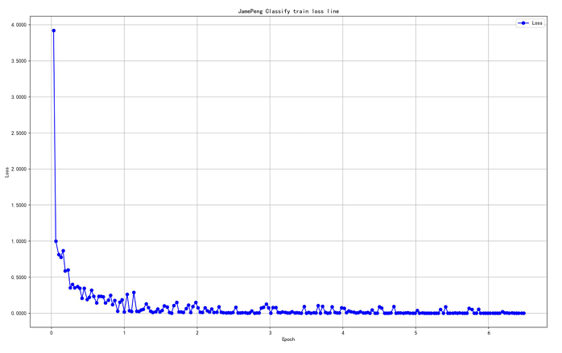
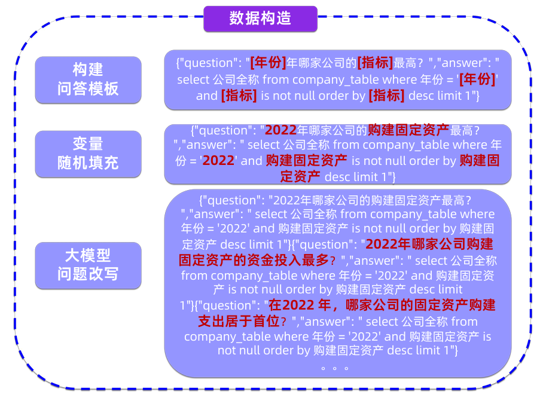
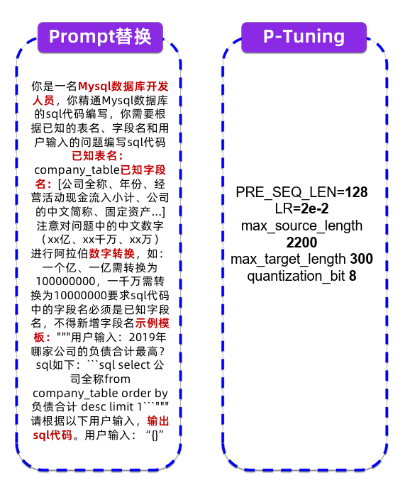
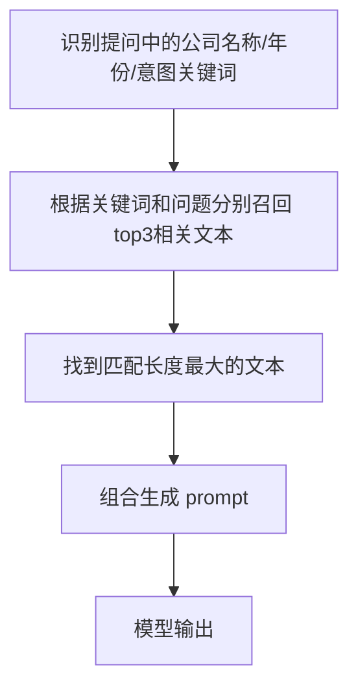

# 模型微调流程
## 问题分类
问题的基本分类有助于模型给出不同形式、更有针对性的答案，问题分类可以大致分为如下四类：

- **基本信息查询**：例如证券信息、股票简称、股票代码、外文名称、法定代表人、注册地址、办公地址、公司网址、电子信箱等；
- **公司员工信息**：例如员工人数、员工专业、员工教育程度等等；
- **财务相关**：例如：金额、费用、资产、收入等等；
- **开放式问题**.

将输入问题分为以上四类，模型需要能在给定一个输入问题时迅速输出问题类别，例如：

```
输入：XX公司法定代表人是谁？
输出：基本信息查询类
```

分类依据在于年报的资料和问题描述本身的文字，一些可用的判断依据有：

- 是否包含**公司名称/年份**；
- 能否匹配到**报表字段**；
- 能否匹配到**公式**；
- 特殊词汇；

问题分类后，不同的问题可以检索不同的部分获取结果：

- 计算类问题需要根据问题类型**检索计算因子**来完成计算；
- 统计分析问题需要根据问题类型分析条件检索来获取结果；
- 开放性问题根据问题关键词来**检索全文相关匹配**来回答问题 


## 建立微调数据库

1. 一开始的微调效果较差，分析后发现是训练字段小于传入模版问题的字符串，导致训练过程中的传入字段丢失截断。loss大于0.2，实用情况比较糟糕。 
2. 通过统计问题和答案长度，调整了 `max_source_length` 参数符合 `max`（问题+答案）的条件，确认了 `max_source_length` 为 `512`， `max_target_length` 为128，使用 ptuning 对 Llama2 进行微调训练，step为250.在这个微调策略下训练结果loss到了0.09，可用。 
3. 为了获取更好的效果，尝试对 prompt 不断进行调整，从一开始的只有选项的题目，到有一定信息的选项描述（高频的关键字等），同时对训练 step 加大到 400，对微调训练有很大的帮助， loss 的下降比较明显, 最优平均值达到 0.01 以下，拥有比较优秀的分类能力。 
4. 尝试调低 Learning Rate 可以获得更快的训练收敛效益。



为了能提高调取数据的效率，考虑使用 NL2SQL 技术，通过模型对话直接输出 SQL 语句，从而提高调取效率。但是在开始的尝试中我们失败了：尝试用公共的NL2SQL训练集，其中主题较为多样驳杂，包含电影、书籍、评价、金融等等。没有能够很好对数据进行SQL生成，基于这个数据集尝试后会发现大模型会失去基本对话能力。

根据失败尝试，我们认为要想稳定生产准确有效SQL语言，是需要根据实际的任务情况和方向来设定训练目标。

为了加快效率，直接利用开源大模型来协助生成不同提问模板，再透过字段的随机条件填充。构建针对其模版格式的问题训练集，我们自己设定了四个模版利用大模型推广扩充出了24种不同问法，强化了除了查询以外的SQL语句，如排序，输出范围，统计计数，条件求和，单字段检索，多字段检索，多字段检索多字段，字段的过滤等，不同比较级的语言描述（高低，大小，多少，否定词+理想，中文数字和阿拉伯数字）。这些扩充和进一步的具体问题模板是为了应对无日志调优情况下，SQL语句广谱性挑战。




示例代码：

- 2019年负债总金额第7高的上市公司为？
```sql title="SQL"
SELECT 公司全称 FROM company_table WHERE 年份 = '2019' AND 负债合计 IS NOT NULL ORDER BY 负债合计 DESC LIMIT 1 OFFSET 6 
```
- 2020年其他流动资产最高的前三家上市公司是哪些家？ 
```sql title="SQL"
SELECT 公司全称 FROM company_table WHERE 年份 = '2020' AND 其他流动资产 IS NOT NULL ORDER BY 其他流动资产 DESC LIMIT 3 
```
- 2020年营业总收入最高的7家并且曾经在武汉注册的上市公司是？金额是？
```sql title="SQL"
SELECT 公司全称, 营业总收入 FROM company_table WHERE 年份 = '2020' AND 注册地址 LIKE '%武汉%' AND 营业总收入 IS NOT NULL ORDER BY 营业总收入 DESC LIMIT 7 
```


## 问题回答策略
### 基本信息查询类
问题解决策略流程图：

具体策略与 prompt 生成：

1. 提取提问中的公司名称/年份信息；
2. 根据公司名称/年份/意图匹配报表表格字段； 
3. 若匹配到文本类字段与多个年份, 则加入文本比较信息；
4. 组合匹配到的字段, 生成prompt；
    - 文本类字段将字段值加双引号；
    - 非文本类字段将字段名称加双引号； 
    - 人数类字段结果为XXX有XXX人, 其他字段结果为XXX是XXX；
    - 金额类字段结果为XXX是XXX元；
5. prompt给模型产生输出；

### 计算分析类
问题分析策略：匹配问题中是否出现比值类关键字，找到比值计算公式，根据公式生成问题链，通过问题链回答解析公式中字段对应的值，通过 Python 计算得到结果，组合问题链结果以及计算结果得到回答。

1. **用户问题**: 在2019年的财务数据中，易华录营业利润率是多少？（保留两位小数）
2. **匹配计算公式**: 营业利润率=营业利润/营业收入
3. **问题链**: 2019年易华录的营业利润是多少元? 2019年易华录的营业收入是多少元?
4. **提取回答进行计算**: 527509725.56/3743903561.80
5. **最终回答**: 易华录2019年的营业利润是527509725.56元。易华录2019年的营业收入是 3743903561.80元。根据公式，营业利润率=营业利润/营业收入得出结果0.14(14.09%) 


### 公司信息类


## 优化方向
### 准确性 
- 提高召回准确率, 是否能在匹配/语义方向下手；
- 增强模型指令遵循的能力, 如何进一步利用简单指令/复杂链式指令/其他指令；
- 提高模型自身的知识能力, 数据集，知识库/知识图谱怎么获得？利用什么训练策略；

### 速度 
- 更精准的召回, 减少需要处理的token数； 
- 大小模型协同, 多模型协同 ，多模态协同，如何更好的实现agent功能；
- 工程方面, 如何cache/量化/加速/压榨gpu性能； 

### 通用性 
- 检索再回答方向, 是否能利用算法完成类似搜索引擎的苟能；
- 直接回答方向, 利用微调/全量训练；