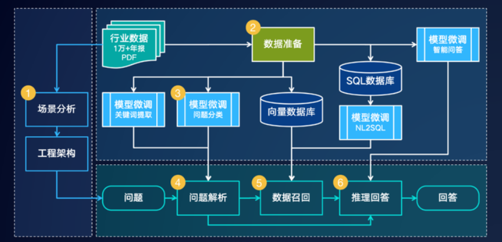
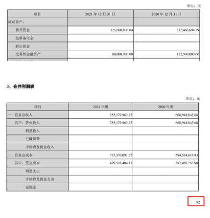
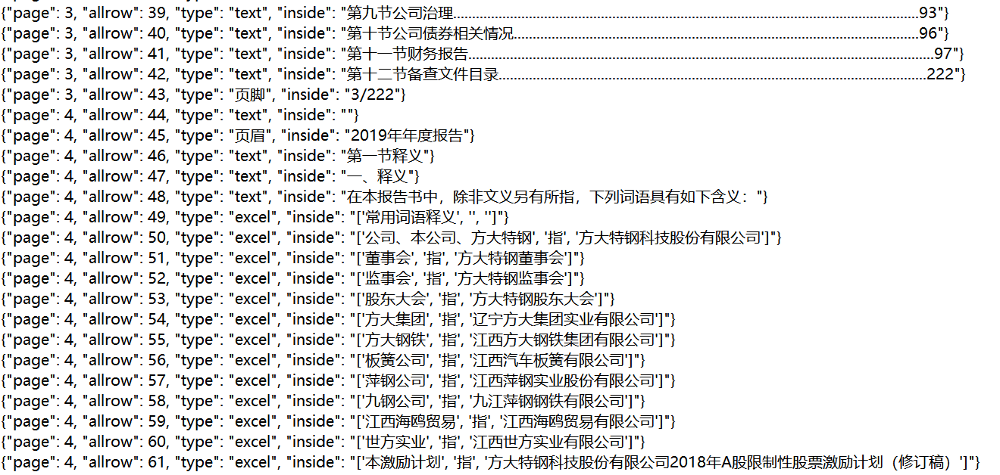

## 数据准备流程
数据准备的流程可以细分如下：

1. **PDF文本和表格提取**：使用如pdfplumber、pdfminer等工具包提取PDF文件中的文本和表格数据。
2. **数据切分**：根据PDF文件的目录、子目录和章节信息，对内容进行精确的切块处理。
3. **构建基础金融数据库**：依据金融知识和PDF内容，设计专业的金融数据库字段和格式。例如，定义资产负债表、现金流量表和利润表等。
4. **信息提取**：使用大模型的信息提取能力和NLP技术来抽取对应的金融字段信息。例如，使用JSON方式输出目录的内容，其中章节的名称作为key，页码作为value。同时，请详细地抽取表格内的数据，以JSON格式输出。
5. 构建金融知识问答库：结合构建的金融数据库，应用大模型构建基础的金融问答库。例如：
```JSON
{"question"："某公司2021年的财务费用为多少元？", "answer": "某公司2021年的财务费用为XXXX元。"}
// (1) prompt:用多种句式修改question及answer的内容。

{"question":"为什么财务费用可以是负的？", "answer": ""}
// (2) prompt：请模仿上面的question给出100个类似的问题与对应的答案，用JSON输出。
```
6. **构建向量库**：借助于如Word2Vec、Text2Vec等技术，从原始文本数据中提取出语义向量。使用pgvector这种基于PostgreSQL的扩展来存储和索引这些向量，从而建立起一个可供高效查询的大规模向量库。
7. **应用**：结合向量库、大模型、langchain等工具，提升应用效果。

为提高团队工作效率，给工程整体绘制一个清晰的框架蓝图，我们构建了如图所示的工作流：



## PDF转存年报
### 解析与抽取

年报文件主要以 PDF 格式呈现，为保证数据可以准确地提取出来，我们采用 pdfplumber 进行提取工作。

`extract_table()`、`find_tables()` 是 pdfplumber 中用于从 PDF 中提取表格数据的函数。该函数可以接受一个可选的参数字典，用于更精细地控制表格数据的提取过程。下面介绍一些常用的参数，仅供参考：

- `vertical_strategy`：用于指定垂直方向上的表格线提取策略，可以是 “lines”、“text” 或 “mixed” 中的任意一种，默认值为 “lines”。
- `horizontal_strategy`：用于指定水平方向上的表格线提取策略，可以是 “lines”、“text” 或 “mixed” 中的任意一种，默认值为 “lines”。
- `snap_tolerance`：用于指定在表格提取过程中两个元素之间的距离阈值，如果它们之间的距离小于该值，则会被视为同一元素。默认值为 3。
- `join_tolerance`：用于指定在表格提取过程中两个单元格相连时的距离阈值，如果它们之间的距离小于该值，则它们将被合并为同一个单元格。默认值为 2。
- `edge_min_length`：用于指定在表格提取过程中一个元素的边缘与页面边缘之间的距离阈值，如果它们之间的距离小于该值，则该元素将被忽略。默认值为 10。
- `min_words`：用于指定一个单元格必须包含的最少文本块数目，默认值为 1。
snap_x_tolerance：用于在表格提取过程中校正列位置的参数，允许水平方向上的一些偏离。默认值为 `None`。
- `snap_y_tolerance`：用于在表格提取过程中校正行位置的参数，允许垂直方向上的一些偏离。默认值为 `None`。
- `intersection_x_tolerance`：用于调整表格列位置的参数，允许一些列交叉或合并。默认值为 `None`。


因为pdf2txt非常的复杂多变，且麻烦。故我们组在以上pdf2txt程序的使用过程中进行了一定的创新举措和微调处理。

先glob读取文件排序，再送入15个进程的进程池进行多进程处理。按pdf.pages页遍历处理，每页通过page遍历存储，通过 `extract_text_and_tables` 函数提取文本和表格，其中表格使用 `page.find_tables()` 获取到表格数据，遍历表格开始处理，一旦有表格了，那么表格和文本都需要提取，通过 `check_lines` 函数，提取文本，得到按行的文本，通过 `new_table = table.extract()` 合并或者去掉一些多余的项，进而得到表格文本；如果没找到表格，调用 `check_lines` 得到文本，并处理页眉页脚。

更加重要的是，我们所做的大模型是针对年报数据的，所以文本转换也必须针对年报类文件，这提供了方便。但问题在于这样有针对性的代码里用了很多正则，碰到某些财报必须人工调整靠肉眼看总结出来。

经过暑假一个月的陆续调整以及聘请专人做人工标注我们基本积累出共计约一万份财报结构化数据。最后我们把输出按行保存 JSON 格式文本到 alltxt2 目录中，文件名变为 `.txt` 后缀。

输出效果示例：
```JSON
{"page": 7, "allrow": 165, "type": "excel", "inside": "['受的政府补助除外）', '', '', '', '']"}
{"page": 7, "allrow": 166, "type": "excel", "inside": "['委托他人投资或管理资产的损益', '11,983,529.98', '9,660,508.21', '4,469,117.34', '']"}
{"page": 7, "allrow": 167, "type": "text", "inside": ""}
{"page": 7, "allrow": 168, "type": "页脚", "inside": "7"}
{"page": 8, "allrow": 171, "type": "excel", "inside": "['除同公司正常经营业务相关的有效套期保', '', '', '', '']"}
{"page": 8, "allrow": 172, "type": "excel", "inside": "['值业务外，持有交易性金融资产、衍生金', '', '', '', '']"}
```


### 页面召回 
模型应可通过查找到的信息索引到对应的页。

### 表格识别
我们考虑应用 camelot-py 实现基于图像识别的表格提取，

```python
row_keywords = ["在职员工","职工人数","专业构成","离退休职",
"生产人员","销售人员","技术人员",
"行政人员","管理人员","业务人员","教育程度","硕士","本科","大专","研究生",
"专科"]
ei_tables = extract_table_for_rows(key, int(1.5*len(row_keywords)),min_match_number=0.3*len(row_keywords),required_line_keywords=["员工情况","员工的数量","员工数量","专业构成","离退休职工人数","员工教育结构"],invalid_line_keywords=[],
required_post_keywords= row_keywords,
invalid_pre_keywords=[],
invalid_post_keywords=[],
prefix_pages=1, post_pages=1)
invalid_keywords = [ "其他单位","董事","经理","审议"]
filtered_tables = filter_tables(ei_tables, invalid_keywords)
```

以一份年报中的实际表格为例，源文件当中表格如下：


目标即从该 PDF 中的原表格中提取出 JSON 格式的表格以方便后续信息提取，并以**关系模型**的形式（可理解为类似 Excel 当中的表格）存入关系数据库当中。

最终提取出的 JSON 格式文件形如下图：




## 数据集样式示例
### 数据集JSON样式示例
训练模型所需要的数据集主要包含两个特征：`question` 和 `answer` ，

```JSON
{"id": 0, "question": "2021年其他流动资产第12高的是哪家上市公司？", "answer": "2021年其他流动资产第12高的公司是苏美达股份有限公司。"}
{"id": 1, "question": "注册地址在重庆的上市公司中，2021年营业收入大于5亿的有多少家？", "answer": "2021年注册在重庆，营业收入大于5亿的公司一共有4家。"}
{"id": 2, "question": "广东华特气体股份有限公司2021年的职工总人数为？", "answer": "2021年广东华特气体股份有限公司职工总人数是1044人。"}
{"id": 3, "question": "在保留两位小数的情况下，请计算出金钼股份2019年的流动负债比率", "answer": "2019金钼股份流动负债比率是61.10%。其中流动负债是1068418275.97元；总负债是1748627619.69元；"}
{"id": 4, "question": "2019年负债总金额最高的上市公司为？", "answer": "2019年负债合计最高的是上海汽车集团股份有限公司。"}
{"id": 5, "question": "2019年总资产最高的前五家上市公司是哪些家？", "answer": "2019年资产总计最高前五家是上海汽车集团股份有限公司、中远海运控股股份有限公司、国投电力控股股份有限公司、华域汽车系统股份有限公司、广州汽车集团股份有限公司。"}
{"id": 6, "question": "2020年营业收入最高的3家并且曾经在宁波注册的上市公司是？金额是？", "answer": "注册在宁波，2020年营业收入最高的3家是宁波均胜电子股份有限公司营业收入47889837616.15元；宁波建工股份有限公司营业收入19796854240.57元；宁波继峰汽车零部件股份有限公司营业收入15732749552.37元。"}
{"id": 7, "question": "注册地址在苏州的上市公司中，2020年利润总额大于5亿的有多少家？", "answer": "2020年注册在苏州，利润总额大于5亿的公司一共有2家。"}
{"id": 8, "question": "浙江运达风电股份有限公司在2019年的时候应收款项融资是多少元？", "answer": "2019年浙江运达风电股份有限公司应收款项融资是51086824.07元。"}
{"id": 9, "question": "神驰机电股份有限公司2020年的注册地址为？", "answer": "2020年神驰机电股份有限公司注册地址是重庆市北碚区童家溪镇同兴北路200号。"}
{"id": 10, "question": "2019年山东惠发食品股份有限公司营业外支出和营业外收入分别是多少元？", "answer": "2019年山东惠发食品股份有限公司营业外收入是1018122.97元；营业外支出是2513885.46元。"}
{"id": 11, "question": "福建广生堂药业股份有限公司2020年年报中提及的财务费用增长率具体是什么？", "answer": "2020福建广生堂药业股份有限公司财务费用增长率是34.33%。其中，财务费用是7766850.48元；上年财务费用是5781839.51元。"}
{"id": 12, "question": "华灿光电股份有限公司2021年的法定代表人与上年相比相同吗？", "answer": "不相同，华灿光电股份有限公司2020年法定代表人是俞信华，2021年法定代表人是郭瑾。"}
{"id": 13, "question": "请具体描述一下2020年仲景食品控股股东是否发生变更。", "answer": "2020年，仲景食品控股股东没有发生变更。"}
{"id": 14, "question": "什么是其他债权投资？", "answer": "其他债权投资是指企业或机构投资者通过购买债券、贷款、定期存款等金融产品获得的固定收益。这些金融产品通常由政府、公司或其他机构发行，具有一定的信用等级和风险。\n\n其他债权投资是企业或机构投资组合中的一部分，通常用于稳定收益和分散风险。与股票投资相比，其他债权投资的风险较低，但收益也相对较低。\n\n其他债权投资的管理和投资策略与其他资产类别类似，包括分散投资、风险控制、收益最大化等。然而，由于其他债权投资的种类繁多，其投资和管理也存在一定的特殊性。"}
```
