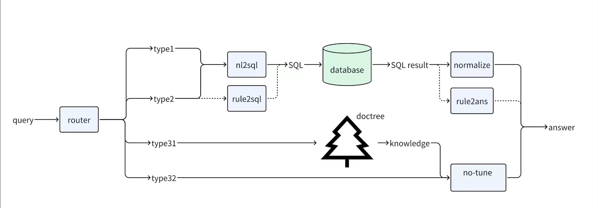

# 数据库存储

## 信息存入
为将数据库加入模型整个的工作流程，我们选择将数据存入 SQL 、Mongo 和 ES 中，通过先前的数据处理后，可将建表写入数据存储到数据库当中，为随后的数据库协同工作流作准备。

## 数据库协同工作流
由于算力缺乏（数据量显然也远远不够）我们所能采用的策略是在小量数据的引导和针对化调整现有开源大模型之后，针对分析企业财报，回答金融问题，给出投资分析的细分场景，我们在实际推理回答中，采用**检索增强生成**（Retrieval Augmented Generation，RAG）技术，把在数据召回阶段所获取的行业知识（通过检索向量知识库）和具体数据（通过查询关系型数据库），结合用户的问题，以及其他上下文与约束条件，一起发给微调后的问答模型，获得更加准确的答案，即微调该问答模型，让模型更懂行业知识。

更进一步，我们采用prompt设计+微调的方式进一步特化其为金融财报类大模型，以此来对用户的问题进行回答。

1. 首先，模型会对用户的提向进行分类，判断用户是想问基本公司信息和财务报表信息还是询问公司年报的相关内容或者是想对整体数据进行查询分析。
2. 对于**查询**或**询问**类的提问，模型需要对用户提向进行意图识别，提取问题的关键词，然后对报表或者年报进行相关信息召回，通过prompt 设计将召回的报表字段和年报内容交由模型进行处理回答。
3. 对于**统计**类分析，主要通过模板和大模型改写的方式来构建 SQL 训练数据，对模型进行微调，增强模型 NL2SQL 的能力，然后直接执行 SQL 来获取分析结果。

SQL 数据库在工作流的协作角色可以在如下的图片中体现：

