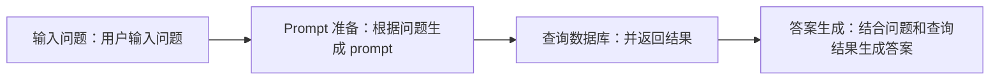

# 模型问答流程
## 工作流程
模型的输入输出流程图如下：

## 数据查询
模型的数据查询分类为两类：

- **数据基本查询**
- **数据统计分析查询**

### 数据基本查询 
利用模型和上市公司年报原始数据，并以此为基础创建信息问答系统。系统需能够解决基本查询，如：某公司2021年的研发费用是多少？等问题。 

### 数据统计分析查询
在上一个阶段的基础上，需要进行金融数据的统计分析和关联指标查询。系统需基于各类指标，提供问题和答案，如：某公司2021年研发费用增长率为多少？等问题。 

## 开放性问题
模型能进一步回答开放性的问题（与经济相关的问题），如：某公司 2021 年主要研发项目是否涉及国家创新领域，如新能源技术、人工智能等。是否看好未来的公司价值进一步提高。