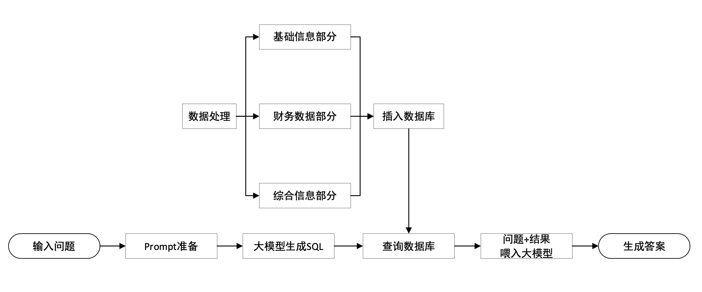

# 基于 Llama2 的财报分析大语言模型
## 项目简介
### 目标产品概述
一个旨在深度解析**上市公司年报**的**对话交互智能系统**。面对金融文本中的专业术语与暗含信息，我们致力于用AI实现专家级别的金融分析。

### 项目动机
在AI领域，虽然已在文本对话取得进展，但真正的金融交互场景仍然是一个巨大挑战。考察过市面上的大多数商业ai金融对话软件或者开源模型后，发现他们在专业性，助手性（是否能满足多维度的金融类助手性任务），交互深度方面均有所欠缺。

### 问题和创新点
为了简化问题和对关键问题进行定点解决，我们的目标是：

- 针对上市公司年报建立，微调，优化出一个具有针对性的大语言模型
- 其他现有创新点包括：
    - 针对单gpu进行了优化，使其甚至能在安卓虚拟框架下运行；
    - 有类agent体系能更广泛的满足定制化需求。

上市公司年报为投资者呈现了公司的经营状况、财务状况和未来规划，投行和证券研究团队在这方面的分析解读历来是工作重心，投入了大量人力和资源，金融专业知识和市场直觉是解读的关键，而我们的目标是通过AI技术让这一过程变得更简单、更准确、更便宜，加速企业的投资研究和市场分析，解放投资研究部门的产能，同时也帮助每一个关注市场的投资者都能够打穿信息壁垒。

## 模型工作流程

